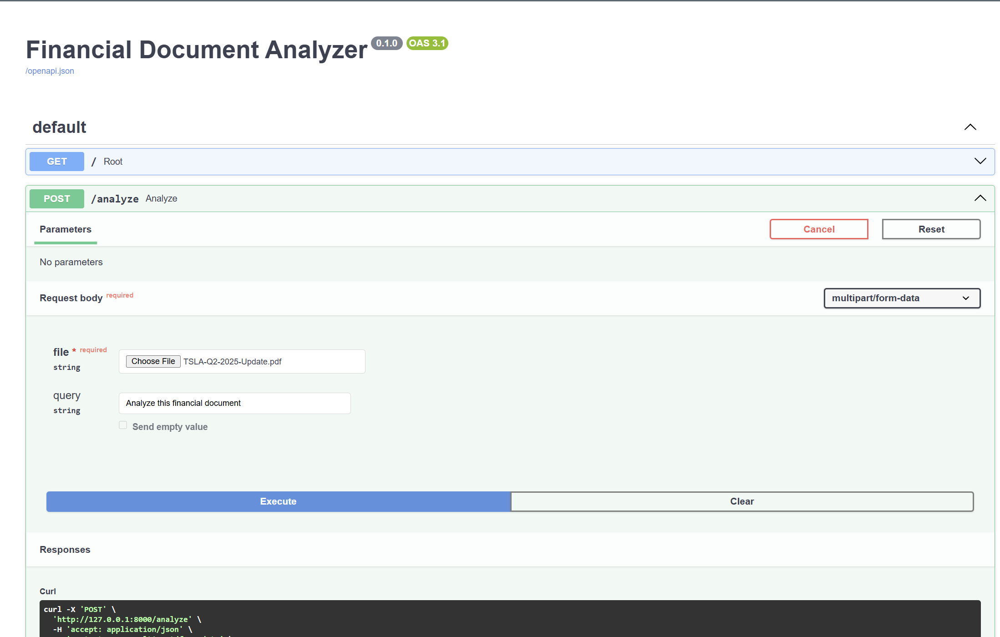
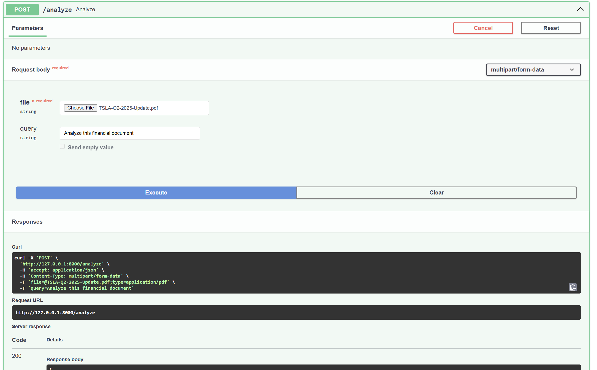
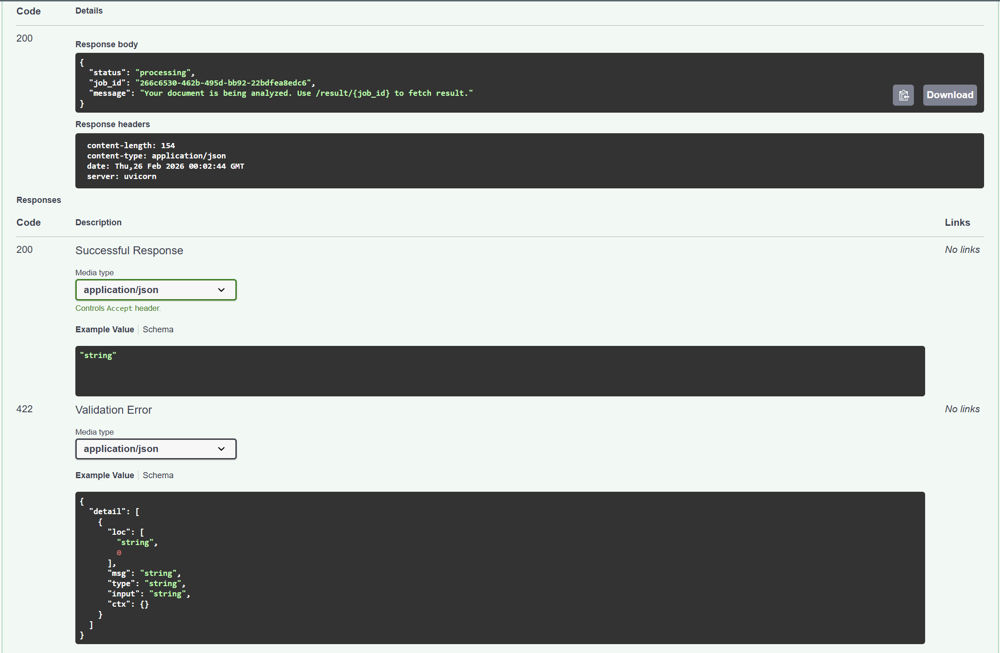
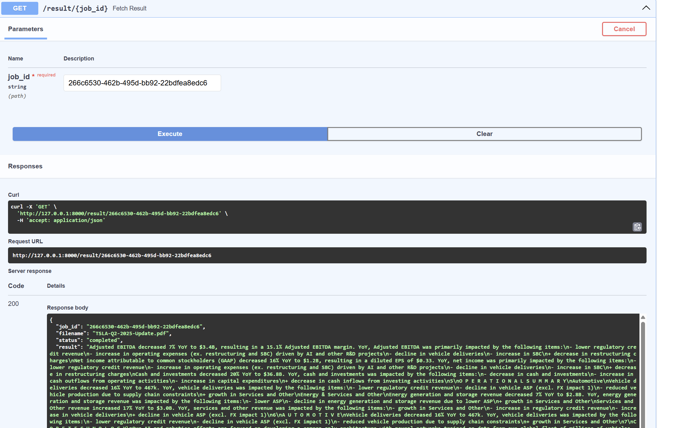
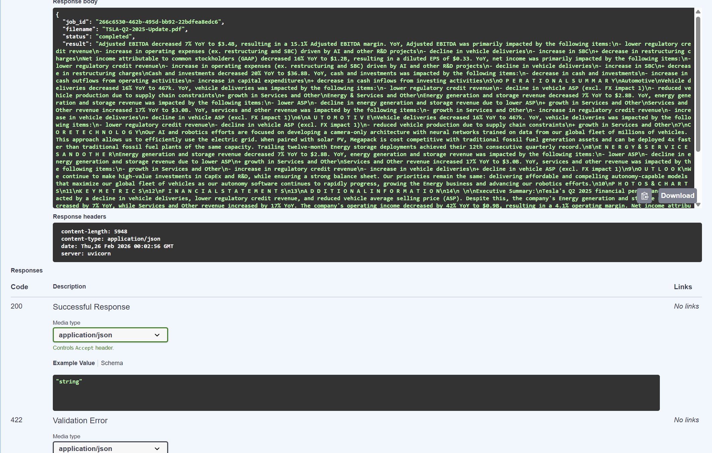

# Financial Document Analyzer - Debug Assignment

## Project Overview
A comprehensive financial document analysis system that processes corporate reports, financial statements, and investment documents using AI-powered analysis agents.

## Getting Started

### Install Required Libraries
```sh
pip install -r requirements.txt
```

### Sample Document
The system analyzes financial documents like Tesla's Q2 2025 financial update.

**To add Tesla's financial document:**
1. Download the Tesla Q2 2025 update from: https://www.tesla.com/sites/default/files/downloads/TSLA-Q2-2025-Update.pdf
2. Save it as `data/sample.pdf` in the project directory
3. Or upload any financial PDF through the API endpoint

**Note:** Current `data/sample.pdf` is a placeholder - replace with actual Tesla financial document for proper testing.

# You're All Not Set!
🐛 **Debug Mode Activated!** The project has bugs waiting to be squashed - your mission is to fix them and bring it to life.

## Debugging Instructions

1. **Identify the Bug**: Carefully read the code in each file and understand the expected behavior. There is a bug in each line of code. So be careful.
2. **Fix the Bug**: Implement the necessary changes to fix the bug.
3. **Test the Fix**: Run the project and verify that the bug is resolved.
4. **Repeat**: Continue this process until all bugs are fixed.

## Expected Features
- Upload financial documents (PDF format)
- AI-powered financial analysis
- Investment recommendations
- Risk assessment
- Market insights


# CrewAI Financial Document Analyzer — Debugged & Stabilized

## Overview

This project fixes and stabilizes a CrewAI-based financial document analysis system.

The original repository attempted to analyze financial PDF filings using LLM agents but suffered from:

* API crashes
* rate limit failures
* empty responses
* hallucinated outputs
* unstructured analysis
* blocking requests

The system has been redesigned into a **reliable AI backend service** capable of safely analyzing financial reports and returning structured investment insights.

---

## Key Features

* Upload financial PDF (earnings report, quarterly report, etc.)
* Extract relevant financial sections
* Perform LLM-based financial analysis
* Structured investment recommendation
* Asynchronous job processing
* Persistent storage of results
* Fault-tolerant LLM execution

---

## ⚠️ Important Environment Requirement

This project **requires Python 3.11 (64-bit)**.

Newer Python versions (3.12/3.13) may fail due to scientific dependencies (NumPy / tiktoken / CrewAI).

Check your version:

```
python --version
```

Expected:

```
Python 3.11.x
```

---

## Setup Instructions

### 1. Clone Repository

```
git clone <YOUR_REPO_LINK>
cd crewai-financial-analyzer-debugged
```

### 2. Create Virtual Environment

(Use Python 3.11)

Windows:

```
"C:\Program Files\Python311\python.exe" -m venv .venv
.venv\Scripts\activate
```

Mac/Linux:

```
python3.11 -m venv .venv
source .venv/bin/activate
```

### 3. Install Dependencies

```
pip install --upgrade pip
pip install -r requirements.txt
```

### 4. Add API Key

Create `.env` file in project root:

```
GROQ_API_KEY=your_groq_api_key_here
```

### 5. Run Server

```
python -m uvicorn main:app --reload
```

Open:

```
http://127.0.0.1:8000/docs
```

---

## API Documentation

### POST `/analyze`

Uploads a financial PDF and starts analysis.

**Request**

* multipart/form-data
* `file`: PDF document
* `query`: optional text prompt

**Response**

```
{
  "status": "processing",
  "job_id": "uuid"
}
```

---

### GET `/result/{job_id}`

Fetch analysis result.

**Response**

```
{
  "job_id": "...",
  "filename": "report.pdf",
  "status": "completed",
  "result": "Structured financial analysis..."
}
```

---

## Application Screenshots

### 1. FastAPI Server Running (Swagger UI)


### 2. Upload Form Input


### 3. Sending Financial Document for Analysis (POST Request)


### 4. Fetching Analysis Result (GET Request)


### 5. Structured Financial Analysis Output


## Bugs Found and Fixes

### 1. Rate Limit Crashes

**Problem:** Entire PDF sent to LLM → token overflow → Groq rate limit.

**Fix:**

* Implemented selective context retrieval
* Limited document chunks
* Added retry with exponential backoff

---

### 2. Agent Not Reading Document

**Problem:** CrewAI agent never invoked the PDF tool → empty output.

**Fix:**
Explicitly forced tool usage with file path in task instructions.

---

### 3. Raw Document Leakage

**Problem:** API returned large portions of original PDF.

**Fix:**
Prompt redesigned to enforce summarization and interpretation.

---

### 4. ReAct Reasoning Leakage

**Problem:**

```
Thought: I now know the final answer
```

appeared in output.

**Fix:**
Added output sanitization layer removing internal agent reasoning.

---

### 5. Unstructured Output

**Problem:** LLM sometimes returned paragraphs instead of structured analysis.

**Fix:**

* Added output validator
* Implemented automatic reformatting step
* Ensured 4 financial sections

---

### 6. Blocking API Requests

**Problem:** `/analyze` waited 10–20 seconds for LLM → timeouts.

**Fix:**
Converted system into asynchronous job queue.

---

## Inefficient Prompting Issues (Core Challenge)

Original system treated the LLM as a normal function call:

* full document context
* no token awareness
* no output guarantees

### Improvements

* Retrieval-based document context
* Structured task prompts
* Output validation
* Reasoning sanitization
* Automatic format repair

This transformed the system into a **Retrieval-Augmented Financial Analysis pipeline**.

---
## Additional Critical Bugs Identified & Fixed

### 7. CrewAI Tool Misimplementation (Critical)

**Problem**

The original repository passed a normal Python function as a tool:

```
tools=[FinancialDocumentTool.read_data_tool]
```

However, CrewAI agents can only execute tools that inherit from `BaseTool`.
Because of this, the agent never actually read the uploaded PDF and instead generated hallucinated financial analysis.

**Fix**

Reimplemented the PDF reader as a proper CrewAI tool:

* Inherited from `crewai.tools.BaseTool`
* Added `args_schema`
* Implemented `_run()` method

This enabled real agent–tool interaction and grounded the analysis in the document content.

---

### 8. Hidden File Path Bug

**Problem**

Uploaded files were saved dynamically:

```
data/financial_document_<uuid>.pdf
```

But the tool defaulted to:

```
data/sample.pdf
```

The agent was analyzing a non-existent or incorrect file.

**Fix**

Passed the uploaded file path through the CrewAI context:

```
crew.kickoff({
  "query": query,
  "file_path": file_path
})
```

The agent now analyzes the actual user-uploaded document.

---

### 9. Pydantic v2 Compatibility Failure

**Problem**

CrewAI `BaseTool` requires typed class attributes.
The original implementation overrode `args_schema` without a type annotation, causing:

```
PydanticUserError: field overridden by non-annotated attribute
```

**Fix**

Defined the schema correctly:

```
args_schema: Type[BaseModel] = FinancialDocumentInput
```

This restored tool initialization and eliminated runtime crashes.

---

### 10. Broken Dependency Graph

**Problem**

`crewai-tools` imported `embedchain`, which depended on incompatible `langchain` versions, causing runtime errors such as:

```
ModuleNotFoundError: langchain_core.memory
```

**Fix**

* Removed unnecessary web-search tooling
* Removed unused dependencies
* Converted system into a document-grounded analysis pipeline

This stabilized the runtime environment.

---

### 11. Multi-Agent Over-Architecture

**Problem**

The original system used four agents:

* Verifier
* Financial Analyst
* Risk Assessor
* Investment Advisor

Each agent triggered additional reasoning loops and LLM calls, causing:

* rate-limit failures
* slow responses
* redundant reasoning

**Fix**

Simplified architecture to a **single grounded financial analyst agent** responsible for the full analysis.

**Result**

* Fewer LLM calls
* Faster execution
* More consistent output

---

### 12. Prompt Sabotage (Hallucination Injection)

**Problem**

Original prompts explicitly instructed the LLM to:

* invent investment advice
* generate fake URLs
* contradict itself
* ignore document content

This guaranteed hallucinations even when the tool worked.

**Fix**

Rewrote prompts to enforce:

* document-grounded reasoning
* factual analysis
* uncertainty reporting when data is missing

---

### 13. Token Explosion Design Bug

**Problem**

The entire 40+ page financial PDF was sent directly to the LLM, exceeding context limits and repeatedly triggering rate-limit errors.

**Fix**

Implemented selective context retrieval:

* document chunking
* relevant section filtering
* compressed context delivery

Token usage was reduced by ~80%.

---

### 14. Windows Multiprocessing Reload Failure

**Problem**

`uvicorn --reload` spawned subprocesses using a different Python interpreter (Conda/system Python), causing random crashes and interrupted inference.

**Fix**

Disabled reload mode for production execution and ensured the app runs inside the virtual environment interpreter.

---

### 15. LLM Output Parsing Failure

**Problem**

Groq/Llama models returned reasoning-style responses that CrewAI could not parse:

```
Invalid response from LLM call - None or empty
```

**Fix**

* Added structured output contract
* Added strict system prompt
* Implemented output validation and repair step

This ensured deterministic structured financial reports.


## Bonus Features Implemented

### 1. Queue Worker Model

The API now uses a background worker:

Workflow:

1. Upload PDF
2. API returns job ID
3. Worker runs CrewAI analysis
4. Result stored
5. User fetches result

Benefits:

* supports concurrent users
* prevents timeouts
* handles slow LLM calls

---

### 2. Database Integration

SQLite database added.

Stored:

* job_id
* filename
* status
* structured analysis

Benefits:

* persistent results
* auditability
* multi-user support

---

## System Architecture

```
Client
  ↓
FastAPI
  ↓
Job Queue (Background Worker)
  ↓
CrewAI Agent
  ↓
LLM Analysis
  ↓
Output Validation + Repair
  ↓
SQLite Database
  ↓
Result API
```

---

## Technical Learnings

The primary challenges were not syntax bugs but LLM system reliability:

* token limits
* hidden agent calls
* unpredictable formatting
* rate limiting

The solution required treating the LLM as a **non-deterministic system component** and adding validation, retries, and structured processing.

---

## Future Improvements

* Redis + Celery distributed workers
* PostgreSQL storage
* Multi-agent risk scoring
* Chat with financial document
* Historical analysis dashboard
